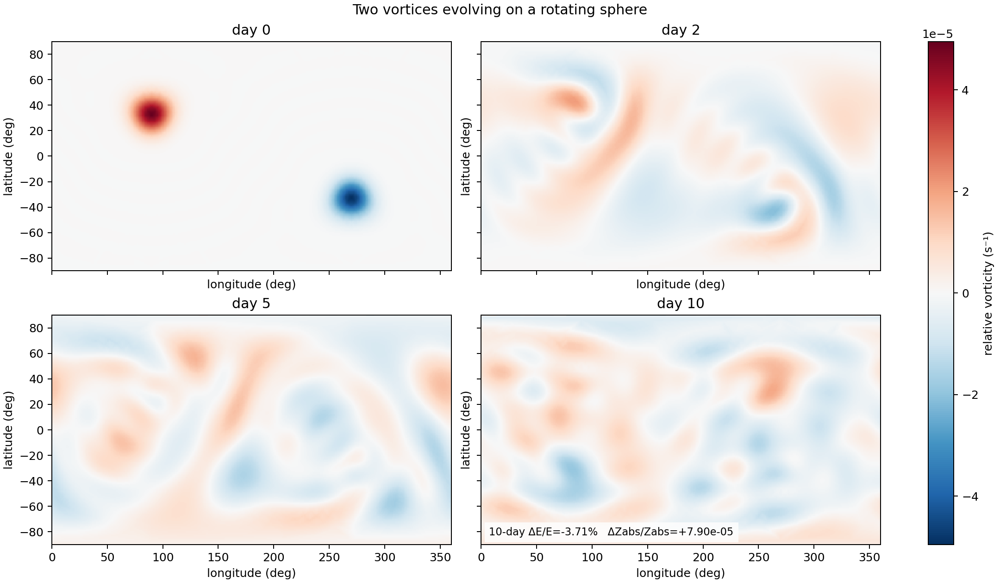

# Aeolus

**A GPU-resident spectral laboratory for two-dimensional flow on a sphere.**

Aeolus advances the non-divergent barotropic vorticity equation (BVE) and
the rotating shallow-water equations with spherical harmonics, and can run
the same models and operators on either an icosahedral geodesic point set or
a Gauss–Legendre latitude–longitude grid. It
is research software for people interested in spherical spectral methods,
backend parity, conservation diagnostics, and reproducible numerical
experiments — **not** a general circulation model.



*A visibly evolving BVE run: two compact vortices stretch into filaments and
broader planetary-scale structure over ten days (geodesic res 4, `lmax=21`,
24 h rotation, inviscid). This is a qualitative dynamics showcase — the
controlled conservation evidence is in [docs/VALIDATION.md](docs/VALIDATION.md),
and the full 40-character configuration is in the tracked
[figure provenance](docs/assets/provenance.json).*

## What Aeolus is

- A rotating-sphere **barotropic-vorticity solver** with RK4 and optional
  Laplacian viscosity, prognostic in relative vorticity.
- An inviscid **rotating shallow-water solver** with optional fixed analytic
  bottom topography, prognostic in vorticity, divergence, and perturbation
  thickness geopotential, verified against the linear gravity-wave dispersion
  relation, Williamson test case 2, and exact lake-at-rest balance over terrain
  (see [docs/SHALLOW_WATER.md](docs/SHALLOW_WATER.md)).
- GPU spherical-harmonic analysis/synthesis in `float64`/`complex128` using
  CuPy, custom CUDA basis kernels, and dense GPU matrix products.
- **Two interchangeable grid backends** — icosahedral geodesic and
  Gauss–Legendre lat–lon — sharing one `(l,m)` coefficient layout, so a run can
  be reproduced on either grid to expose grid-orientation and quadrature errors.
- **Immutable run capsules** carrying command/configuration, Git and GPU
  provenance, per-step diagnostics, spectra, saved states, and plots.
- Rossby–Haurwitz wavenumber-4 (`rh4`) validation and backend-parity tests.

## What Aeolus is not

Aeolus does **not** solve the primitive equations or any GCM / weather
model. It has no vertical structure, forcing, moisture, or thermodynamics.
The shallow-water core is inviscid and supports only fixed analytic bottom
topography (`flat` or one Gaussian mountain); the separate terrain generated
by `Planet.generate` remains decorative, and no topography is coupled to the
primitive-equation foundation. See
[docs/KNOWN_LIMITATIONS.md](docs/KNOWN_LIMITATIONS.md).

## Quick start

Requires Python 3.12, an NVIDIA CUDA-capable GPU, a compatible driver/toolkit,
and Git. Tested on Windows/PowerShell with Python 3.12.12, CuPy 13.4.0, and
CUDA 11.8.

```powershell
git clone https://github.com/AlexandreEros/Aeolus.git
cd Aeolus
py -3.12 -m venv venv
.\venv\Scripts\Activate.ps1
pip install -r requirements.txt
pip install -e .
```

`requirements.txt` pins the known-good environment (`cupy-cuda11x==13.4.0` for
CUDA 11.x). For CUDA 12.x, replace that one pin with `cupy-cuda12x==13.4.0`;
install exactly one CuPy package. Confirm the GPU is visible:

```powershell
python -c "import cupy as cp; print(cp.cuda.runtime.getDeviceProperties(0)['name'])"
aeolus --help
```

`aeolus` is the canonical command-line interface. The `psx-bve`, `psx-gen`,
and `psx-recompile` commands remain available as compatibility entry points
(see below). Entry points are created at install time, so rerun
`pip install -e .` after pulling a change that touches them.

If PowerShell blocks venv activation, allow it for the current process only
(`Set-ExecutionPolicy -Scope Process -ExecutionPolicy Bypass`) and activate
again. See [docs/KNOWN_LIMITATIONS.md](docs/KNOWN_LIMITATIONS.md) for the CUDA/
CuPy compatibility notes.

## Minimal run examples

Short two-vortex smoke run (the README quickstart configuration, packaged as
a preset):

```powershell
aeolus run bve --preset two-vortices-quick
```

The same quickstart on the Gauss lat–lon backend (the `12 × 24` state grid is
adequate for `l_max=8`; fine products are evaluated on the required `13 × 25`
grid):

```powershell
aeolus run bve --preset two-vortices-quick --backend gauss-latlon
```

One-day RH4 validation run at the production default envelope:

```powershell
aeolus run bve --preset rh4
```

which is shorthand for:

```powershell
aeolus run bve --backend geodesic --resolution 4 --l-max 21 --scenario rh4 --day-hours 24 --days 1 --snapshot-interval-seconds 21600 --product-quadrature fine --viscosity 0 --experiment validation-rh4
```

Explicit flags always override preset values. The CLI prints the resolved
configuration and the absolute run directory, and updates
`runs/latest_run.txt`. `aeolus run bve --help` is the complete, current
source of truth for options; `aeolus list presets` and
`aeolus list scenarios` enumerate the available presets and initial
conditions, and `aeolus inspect runs` summarizes the latest run capsule.

One-day shallow-water run of Williamson test case 2 (steady nonlinear zonal
geostrophic flow) with default settings, and the same on the Gauss backend:

```powershell
aeolus run swe
aeolus run swe --backend gauss-latlon --nlat 32 --nlon 64 --l-max 15
```

`aeolus run swe --help` lists the (deliberately minimal) shallow-water
options — gravity, mean depth, rotation, radius, resolution, duration, and
the snapshot schedule, plus optional fixed Gaussian-mountain topography; the
model and its verification are documented in
[docs/SHALLOW_WATER.md](docs/SHALLOW_WATER.md).

The first runnable dry **primitive-equation** experiment (hydrostatic,
sigma-coordinate, fixed-step RK4; no forcing, diffusion, or semi-implicit
terms) is exposed the same way:

```powershell
aeolus run pe                                  # tiny thermal_wave demo
aeolus run pe --scenario isothermal_rest       # verify the exact-rest property
aeolus run pe --backend gauss-latlon --nlat 32 --nlon 64 --l-max 15
```

`aeolus run pe --help` lists the options — backend/resolution, `--levels` or
explicit `--sigma-interfaces`, the dry gas constants, the initial-condition
preset and its temperature/pressure/amplitude, the **fixed** `--dt-seconds`
step, duration, and the snapshot schedule; the runner is documented in
[docs/PRIMITIVE_EQUATIONS_RUNNER.md](docs/PRIMITIVE_EQUATIONS_RUNNER.md).

### Snapshots and plots

Field-state storage and image generation are controlled independently:

- `--n-snapshots N` (canonical, default `5`) stores `N` evenly spaced states
  **including both `t=0` and `t_end`**. `N=0` stores no field snapshots;
  `N=1` stores only the final state. For the default one-day run, `N=5`
  reproduces the historical 0 h / 6 h / 12 h / 18 h / 24 h states.
- `--snapshot-interval-seconds S` (compatibility alias `--dt-snapshots`)
  keeps the historical interval semantics instead: `t=0` and every interval
  boundary are stored, and the final state is stored **only** when the
  duration is a multiple of the interval. The two controls are mutually
  exclusive. Legacy `psx-bve` invocations default to a 21600 s interval, so
  existing commands behave exactly as before.
- `--plot TYPE` (repeatable: `diagnostics`, `snapshots`, `summary`, or
  `all`) selects which image products to render; `--no-plots` renders none.
  The `snapshots` product is published as one staged directory containing
  `physical/` and `spectral/` frames plus a representative `timeline.png` in
  each representation. Both views use the persisted snapshot time axis and
  the same full-sequence normalization as their complete frame sets. Physical
  frames visibly separate prognostic state from instantaneous diagnostic
  fields; BVE diagnostics include streamfunction and velocity streamlines,
  while SWE derives velocity and `h' = Phi'/g` from each persisted state.
  Spectral coefficient frames use cyclic hue for phase and timeline-wide
  relative amplitude in decibels for saturation (default `[-60, 0] dB`),
  with valid zeros white and the invalid `m > l` triangle gray.
  Field snapshots (`vorticity_coeffs.npy` / `vorticity_grid.npy`), their
  authoritative `bve_snapshot_times.npy` time axis, and the
  per-step numerical diagnostics CSV are always written regardless of plot
  selection, so `--n-snapshots 20 --no-plots` saves twenty states without
  rendering a single figure, and `--n-snapshots 0` still yields a
  diagnostics-only run.

### Compatibility entry points

`psx-bve`, `psx-gen`, and `psx-recompile` delegate to the same
implementations as `aeolus run bve`, `aeolus gen`, and `aeolus recompile`.
Existing option spellings (`--lmax`, `--grid`, `--duration-days`,
`--dt-snapshots`) remain accepted everywhere as aliases of the canonical
names, and legacy interval-based invocations keep their historical run-id
format, `config.json` keys, and output behavior. `config.json` additionally
records `snapshot_mode`, `n_snapshots`, `snapshot_times`, and `plots`
(additive keys only).

## Example outputs


*One-day RH4 comparison across both backends (commit `4a840226`, `L=21`, 24 h
rotation, inviscid). RH4 is a shape-preserving traveling wave: success means the
pattern translates at the analytic phase speed without deforming. Full figure
discussion and provenance are in [docs/VALIDATION.md](docs/VALIDATION.md).*

## Validation snapshot

> The **Gauss lat–lon backend is the stronger quadrature reference**; the
> **geodesic backend is experimental** — its Voronoi quadrature is approximate
> and orientation-dependent. The numbers below are measurements of the discrete
> solver, not analytic guarantees.

| Evidence | Result |
|---|---|
| RH4 geodesic, 5 days (res-4 state, res-5 fine product grid) | relative energy drift **−4.4555×10⁻⁴** |
| RH4 Gauss lat–lon, matched timestep (`32 × 64`) | energy drift **−1.34×10⁻¹⁰** |
| Transform round trip, `L=21` (geodesic vs Gauss) | relative L2 residual **1.04×10⁻²** vs **6.84×10⁻¹⁵** |
| Test suite (Python 3.12.12, CuPy 13.4.0, MX110; GPU-guarded tests skipped without CUDA) | **571 passed** |

The five-day geodesic energy number is locked by
`test_prediction_p1_5day_energy_drift`. Full tables, conservation diagnostics,
and orientation/rotation-equivalence tests are in
[docs/VALIDATION.md](docs/VALIDATION.md).

## Documentation

- [docs/VALIDATION.md](docs/VALIDATION.md) — RH4 backend comparison,
  conservation diagnostics, geodesic-vs-Gauss discussion, rotation tests.
- [docs/ARCHITECTURE.md](docs/ARCHITECTURE.md) — package layout, backends,
  spectral transform flow, output capsules/provenance, adding a backend.
- [docs/KNOWN_LIMITATIONS.md](docs/KNOWN_LIMITATIONS.md) — BVE-only status,
  CUDA/CuPy assumptions, quadrature limits, path to shallow water.
- [docs/MATHEMATICAL_MODEL.md](docs/MATHEMATICAL_MODEL.md) — equations and conventions.
- [docs/SHALLOW_WATER.md](docs/SHALLOW_WATER.md) — the rotating shallow-water
  core: prognostics, discretization, CFL, scenarios, verification status.
- [docs/PRIMITIVE_EQUATIONS_DESIGN.md](docs/PRIMITIVE_EQUATIONS_DESIGN.md) and
  [docs/PRIMITIVE_EQUATIONS_RUNNER.md](docs/PRIMITIVE_EQUATIONS_RUNNER.md) —
  the dry hydrostatic primitive-equation core and its first runnable
  fixed-step experiment (presets, capsule schema, diagnostics, results).
- Deeper audit records: [docs/KNOWN_RISKS.md](docs/KNOWN_RISKS.md),
  [docs/VALIDATION_PLAN.md](docs/VALIDATION_PLAN.md),
  [docs/validation/](docs/validation/), and the current mermaid
  [class](docs/class-structure.md) / [call](docs/call-structure.md) diagrams.

## Current limitations

- Single-layer dynamics only (BVE and shallow water with fixed analytic
  topography): no time-dependent or data-driven terrain, forcing, or
  primitive-equation topography coupling.
- GPU/CuPy only: no production CPU fallback or CPU CI path.
- The advective CFL ceiling is recomputed from every accepted state (genuine
  state-adaptive advective stepping), but explicit-viscosity (`ν∇²`) stability
  is not controlled, and the state band extends above the nonlinear tendency
  cut, so conservation is measured, not guaranteed.
- The geodesic transform and product quadrature remain approximate; the Gauss
  backend is the stronger quadrature reference.

Full detail — with severity, evidence, and open items — is in
[docs/KNOWN_LIMITATIONS.md](docs/KNOWN_LIMITATIONS.md),
[docs/KNOWN_RISKS.md](docs/KNOWN_RISKS.md), and
[docs/VALIDATION_PLAN.md](docs/VALIDATION_PLAN.md).
