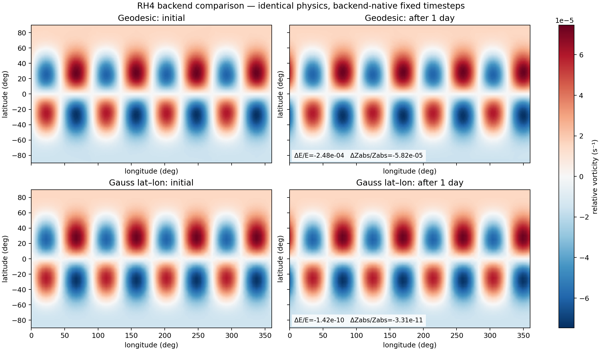
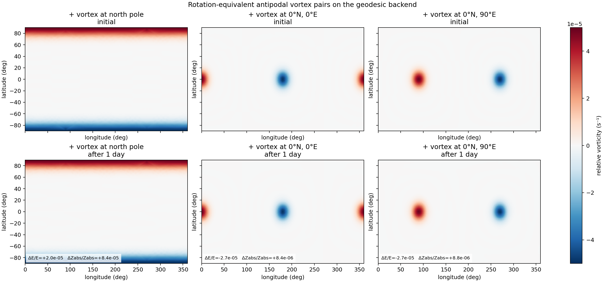
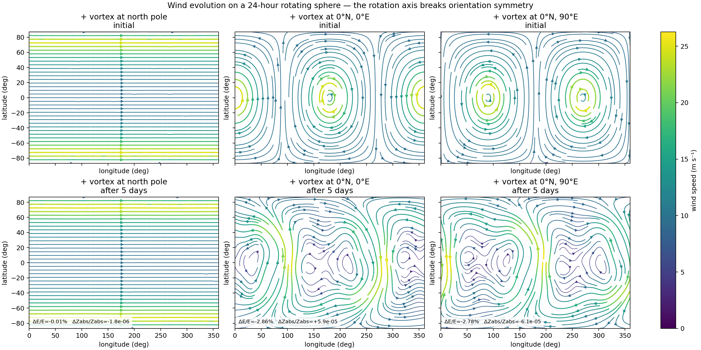

# Validation

This document collects Aeolus's current validation evidence: the Rossby–Haurwitz
backend comparison, conservation diagnostics, the geodesic-vs-Gauss quadrature
discussion, orientation/rotation-equivalence tests, and the known numerical
risks that remain open.

> **Reading guide.** The **Gauss latitude–longitude backend is the stronger
> quadrature reference**: tensor-product Gauss–Legendre × periodic longitude
> gives floating-point-exact analysis for band-limited fields and exact
> quadratic-product projection at the documented dimensions. The **geodesic
> backend is experimental**: its Voronoi quadrature is approximate and
> orientation-dependent, and its overresolved product grid reduces aliasing but
> is not exact dealiasing. Numbers in the tables below are *measurements* of the
> discrete solver, not analytic guarantees.

## RH4 benchmark

The strongest current evidence uses an Earth-like rotating sphere
(`day_hours=24`, `Ω≈7.272×10⁻⁵ s⁻¹`), `lmax=21`, tendency cut
`floor(2L/3)=14`, inviscid RK4, and the analytic Rossby–Haurwitz wavenumber-4
initial condition (`ν=K=7.848×10⁻⁶ s⁻¹`).

RH4 is intentionally a shape-preserving traveling wave, not a dramatic flow
showcase: success means that its pattern translates at the analytic phase speed
without deforming. In the tracked one-day geodesic run it moved 12.254° east
versus the analytic 12.260°, while its `(l,m)=(5,4)` amplitude changed by only
−0.031%.

### Measured benchmark results

| Evidence | Exact configuration | Result |
|---|---|---|
| RH4 geodesic, 5 days | res-4 state (2,562 points), res-5 fine product grid (10,242 points), `dt=2204.08 s`, 196 steps | relative energy drift **−4.4555×10⁻⁴**; absolute-enstrophy drift **−8.46×10⁻⁵** |
| RH4 Gauss lat–lon, matched timestep | `32 × 64` state/product grid, same `dt=2204.08 s`, 196 steps | energy drift **−1.34×10⁻¹⁰**; absolute-enstrophy drift **−3.12×10⁻¹¹** |
| Transform round trip | seeded random band-limited coefficients, `L=21`; geodesic res 4 vs Gauss `32 × 64` | relative L2 residual **1.0355×10⁻²** vs **6.8418×10⁻¹⁵** |
| Current GPU test suite | Python 3.12.12, CuPy 13.4.0, MX110; `pytest --basetemp .pytest-tmp-readme` | **105 passed**, one warning, 59.17 s |

The five-day geodesic energy number is locked by
`test_prediction_p1_5day_energy_drift`; the matched-timestep comparison and
quadrature derivation are documented in
[the lat–lon backend review](validation/latlon_backend_review.md). The
geodesic product-grid attribution and preregistered prediction are in
[the R-3 characterization](validation/r3_characterization.md).

The single most important line of this table is the **transform round trip**:
under the same band-limited input the Gauss backend is exact to floating point
(`≈7×10⁻¹⁵`) while the geodesic backend carries a `≈1×10⁻²` residual. Everything
downstream inherits that gap.

*One-day RH4 visual/backend comparison, commit `4a840226`. Geodesic run
`20260713T022542Z_rh4_rot24h_r4_l21_dt6h_4a840226`: res 4, fine res-5 product
grid, backend-native 40-step sequence. Lat–lon run
`20260713T022748Z_rh4_rot24h_r4_l21_dt6h_4a840226`: `32 × 64` state/product
grid, backend-native 32-step sequence. Both use `L=21`, 24 h rotation,
`ν=0`, one day, 6 h snapshots. These are not the matched-timestep five-day
numbers in the table; full manifests are preserved in
[figure provenance](assets/provenance.json).*

## Conservation diagnostics and analytic guarantees

- On the continuous inviscid, unforced BVE, kinetic energy, circulation, and
  absolute enstrophy are invariants; RH4 is an analytic traveling solution.
- The spectral Laplacian/inverse use the analytic eigenvalues
  `−l(l+1)/R²`; the `l=0` tendency is explicitly zeroed.
- The Gauss state and quadratic-product transforms have exactness envelopes for
  band-limited inputs, up to floating-point error (see
  [ARCHITECTURE.md](ARCHITECTURE.md#nonlinear-product-quadrature)).
- Classical RK4 is fourth-order for sufficiently smooth solutions, but it does
  not analytically conserve the BVE invariants.

These mathematical properties do not automatically transfer to the whole
discrete geodesic solver. The tables report measurements, not guarantees.

The authoritative per-run conservation record is
`diagnostics/timeseries.csv` in each capsule — one flushed row per accepted
step, including energy, relative and absolute enstrophy, circulation, CFL,
high-degree content, and periodic transform residuals. The viewer summary image
is for visual inspection only and is not the scientific invariant record.

## Geodesic vs Gauss lat–lon

The two backends produce the same `(l,m)` coefficient layout and enter the BVE
through the same `SphericalGridBackend`, so a run can be reproduced on either
grid. Keeping both exposes grid-orientation and quadrature errors that a single
implementation could hide.

- The **Gauss lat–lon backend** is the mathematically controlled reference.
  Tensor-product Gauss–Legendre × periodic-longitude quadrature gives
  floating-point-exact analysis for adequately band-limited fields and exact
  quadratic-product projection at the documented dimensions. It is also much
  faster and smaller at the present dense-transform resolutions.
- The **geodesic backend** exercises arbitrary point-set transforms on a
  quasi-uniform icosahedral mesh. It is the path toward geometry-independent
  spherical numerics and avoids the pole concentration of a structured grid, but
  its Voronoi quadrature is approximate and orientation-dependent.

For the quadrature dimensions that make the Gauss product projection exact, and
the overresolved geodesic co-grid that only approximates it, see
[ARCHITECTURE.md § Nonlinear product quadrature](ARCHITECTURE.md#nonlinear-product-quadrature).

## Orientation and rotation-equivalence tests

The non-rotating control asks whether the geodesic discretization treats rigidly
rotated initial conditions alike. With `Ω=0`, the continuous equations have no
preferred axis, and these antipodal vortex pairs are nearly steady, so any
measured drift difference between orientations is pure grid-orientation
sensitivity.

*Three one-day, non-rotating geodesic runs at commit `4a840226`: res 4,
`L=21`, fine res-5 product grid, inviscid, 12 h snapshots, antipodal Gaussian
vortices of amplitude `±5×10⁻⁵ s⁻¹` and width 10°. Positive centers and run IDs:
north pole — `20260713T024849Z_two-vortices-north-pole_norot_r4_l21_dt12h_4a840226`;
`0°N, 0°E` — `20260713T024900Z_two-vortices-equator-0e_norot_r4_l21_dt12h_4a840226`;
`0°N, 90°E` — `20260713T024914Z_two-vortices-equator-90e_norot_r4_l21_dt12h_4a840226`.
The non-rotating configuration makes the three initial conditions physically
equivalent under rigid rotations; measured drift differences expose residual
grid-orientation sensitivity. Exact centers, configs, commits, and dirty flags
are in [figure provenance](assets/provenance.json).*

Turning on a 24-hour planetary rotation changes the question. The polar axis now
has physical meaning: only longitude rotations remain equivalent, while a
pattern rotated from the pole to the equator encounters a different planetary-
vorticity gradient. In the BVE this Coriolis influence enters through absolute
vorticity `q = ζ + f`, with `f = 2Ω sin φ`; its meridional gradient is the
classical beta effect. Wind is diagnosed from the evolving streamfunction, so
the streamlines below show how the resulting circulation changes direction and
structure.

*Initial and five-day wind streamlines on a 24-hour rotating sphere; color is
physical wind speed. The pole-aligned pair remains almost axisymmetric, while
the equatorial pairs develop strongly reorganized flow. The `0°E` and `90°E`
cases remain longitude-shifted counterparts, as axial rotation preserves
longitude symmetry. All runs use commit `4a840226`, geodesic res 4, `L=21`, a
fine res-5 product grid, `ν=0`, and daily snapshots. Run IDs: north pole —
`20260713T044006Z_two-vortices-north-pole_rot24h_r4_l21_dt24h_4a840226`;
`0°N, 0°E` —
`20260713T044027Z_two-vortices-equator-0e_rot24h_r4_l21_dt24h_4a840226`;
`0°N, 90°E` —
`20260713T044053Z_two-vortices-equator-90e_rot24h_r4_l21_dt24h_4a840226`.
The displayed invariant drifts make this a qualitative Coriolis/beta-effect
comparison rather than a conservation benchmark; exact manifests are in
[figure provenance](assets/provenance.json).*

## Known numerical risks

- Geodesic Voronoi quadrature is approximate and orientation-dependent; its
  res-`(r+1)` product grid reduces aliasing but is not exact dealiasing.
- The prognostic state retains modes through `L=21` while each nonlinear
  tendency is cut at `l=14`. That is not a consistent Galerkin truncation of
  either band, so energy/enstrophy conservation is not guaranteed when
  nonlinear transfer reaches modes 15–21.
- The advective CFL ceiling is recomputed from every accepted state (R-4), so
  an accelerating flow tightens the step rather than eroding its advective
  margin; explicit-viscosity (`ν∇²`) stability is still not controlled.
- There is no independent CPU dynamical core, and the present tests require a
  working CUDA GPU.

For the full audit trail, severity ratings, evidence, and open items, see
[KNOWN_RISKS.md](KNOWN_RISKS.md) and [VALIDATION_PLAN.md](VALIDATION_PLAN.md).
Both began as audit snapshots, so use their dated fix logs and the current
asserting tests when an older status paragraph conflicts with the
implementation. A summary of remaining limitations is in
[KNOWN_LIMITATIONS.md](KNOWN_LIMITATIONS.md).
