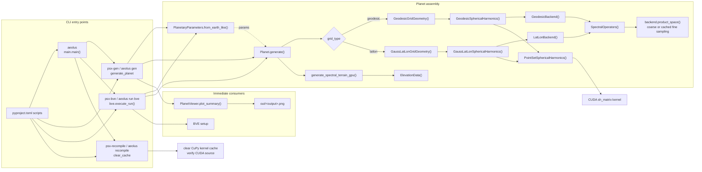
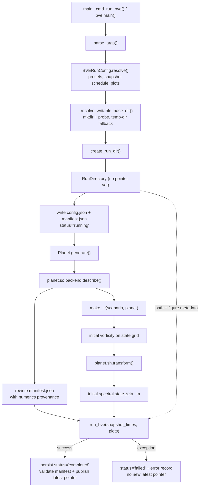
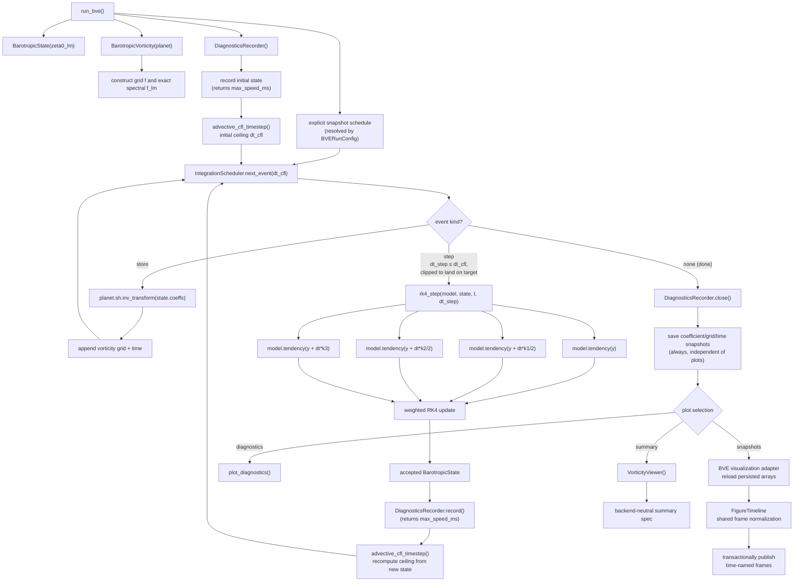
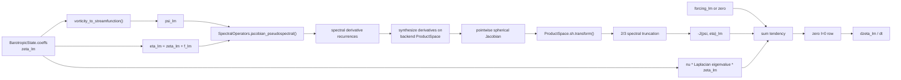
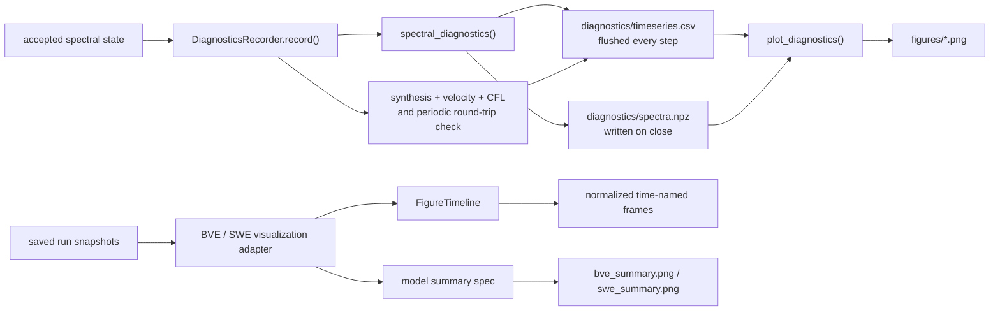

# Call Structure

Updated from the implementation on 2026-07-15. Solid arrows are direct calls
or construction; dashed arrows show selected data passed into a later stage.

## Entry points and planet construction

`aeolus` (cli/main.py) is the canonical executable; its `run bve`, `gen`, and
`recompile` subcommands share implementations with the `psx-*` compatibility
entry points. `aeolus list` and `aeolus inspect` are pure-stdlib and never
reach the assembly stage below.

The two production grid paths converge at the same coefficient layout and
dense GPU point-set transform. `SpectralOperators` receives the selected
backend, which owns nonlinear-product sampling. A fine product space is built
once on first use and then cached.

## `aeolus run bve` setup and provenance

Parsing and configuration resolution happen before any CuPy import:
`BVERunConfig.resolve()` (run/bve/config.py) layers explicit flags over the
selected preset over ordinary defaults, resolves the snapshot schedule and
plot selection, validates cross-field constraints, and prints the resolved
configuration. Only then does `execute_run` create the run directory and
import the numerical stack.

If the requested output base cannot be created *or* is not writable
(either the `mkdir` fails or a probe file cannot be written), setup moves
the run beneath a system temporary directory before creating its
immutable run folder — so neither an unwritable target nor a missing
parent escapes as an unhandled exception. The manifest records the
actual backend, grid, transform, product sampling, `l_max`, environment,
GPU, command, and Git provenance. A fresh failed run never publishes
`latest_run.txt`. Before overwriting the run currently referenced by that
pointer, Aeolus strictly clears the pointer and transitions the capsule away
from `completed`; cleanup or execution failure then persists `failed` and
leaves the pointer absent. Successful publication validates a matching
`status='completed'` manifest and atomically replaces `latest_run.txt`, so
shell scripts never receive a missing, malformed, running, or failed capsule.

## BVE integration loop

Image products run in a fixed order (diagnostics, snapshots, summary) and
only when selected; `--no-plots` skips all of them while the `.npy` states
and diagnostics CSV are still written.

## One tendency evaluation

Absolute vorticity is assembled directly in spectral space; the active RK4
path does not synthesize and re-analyze the state merely to add the Coriolis
term. The product is analyzed once on the backend-selected sampling and
returned spectrally to the integrator.

## Diagnostics and output products

Optional diagnostic plotting failures are caught so completed numerical data
remain available. Selected snapshot/summary failures propagate, allowing the
run lifecycle to mark the capsule failed and withhold latest-run publication.
