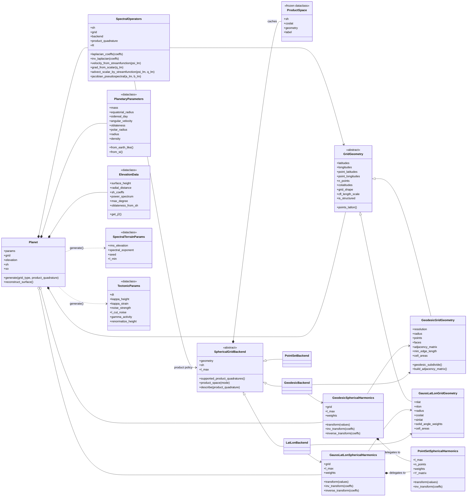
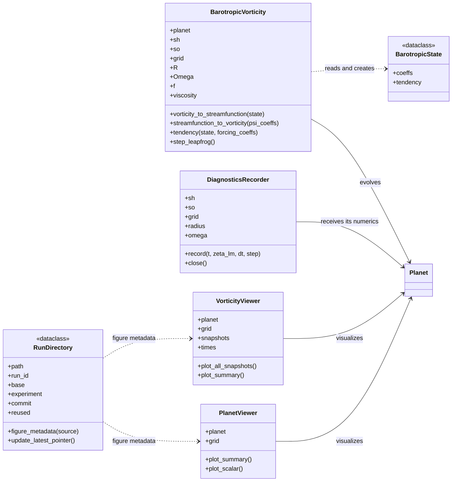
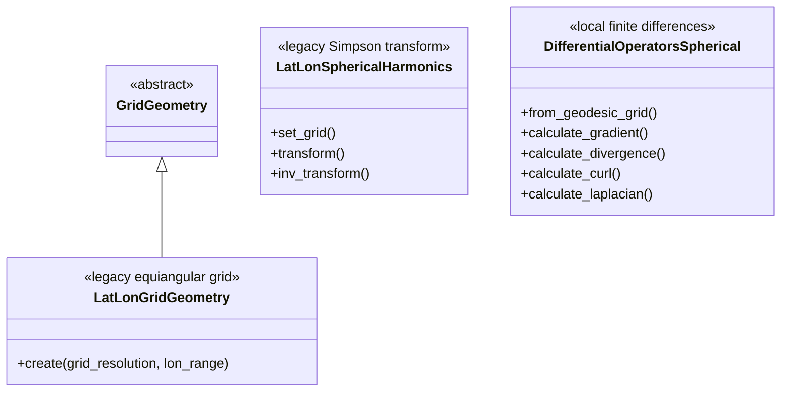

# Class Structure

Updated from the implementation on 2026-07-12. The diagrams separate the
load-bearing runtime classes from legacy and support classes so that the main
relationships remain readable.

## Core numerics and planet assembly

`Planet.generate()` selects one of two production families:

- `grid_type="geodesic"`: `GeodesicGridGeometry` +
  `GeodesicSphericalHarmonics` + `GeodesicBackend`.
- `grid_type="latlon"`: `GaussLatLonGridGeometry` +
  `GaussLatLonSphericalHarmonics` + `LatLonBackend`.

Both transform facades delegate their dense GPU analysis/synthesis work to
`PointSetSphericalHarmonics`. `SpectralOperators` asks the backend for a
cached `ProductSpace`; `coarse` uses the state sampling, while `fine` uses a
resolution-(r+1) geodesic grid or a 3/2-rule Gauss–Legendre grid.

## BVE runtime, diagnostics, and visualization

`run_bve()` and `rk4_step()` are orchestration functions rather than classes.
They own the integration loop, pass `BarotropicState` through the model,
record every accepted step with `DiagnosticsRecorder`, save snapshots, and
construct `VorticityViewer`. The CLI creates a `RunDirectory` and writes the
run manifest/provenance around that flow.

## Secondary and legacy classes

The legacy equiangular grid/Simpson transform remain in the package for
comparison and compatibility but are not selected by `Planet.generate()`.
`DifferentialOperatorsSpherical` is retained as a local finite-difference
operator family; the active BVE path uses `SpectralOperators` instead.
